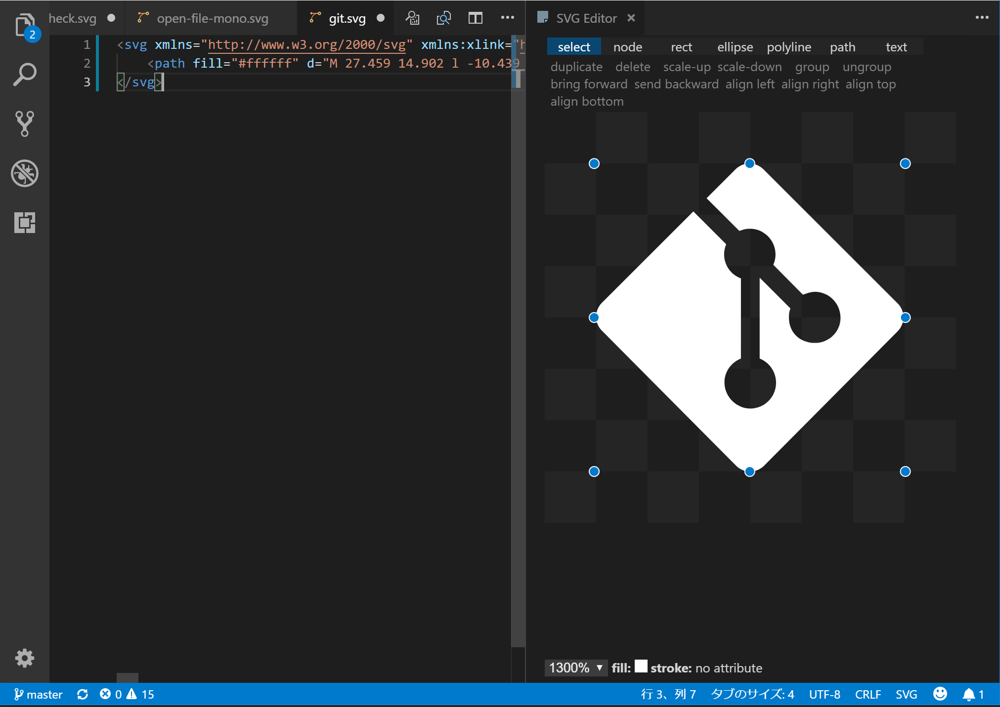

# SVG Editor

**ver 2.3**: `ctrl+c`, `ctrl+x`, `ctrl+v`, `delete/backspace` is now available 😅

Now your VSCode can mutate to an interactive visual & literal SVG editor 😎

You can create shapes using the SVG's coder or directly creating shapes with the shaping tool.

## Commands

|command|title|
|:---|:---|
|svgeditor.openSvgEditor|Open SVG Editor|
|svgeditor.newSvgEditor|New File with SVG Editor|
|svgeditor.reopenRelatedTextEditor|Reopen Text Editor Related to Current SVG Editor|

## Configuration

|name|description|default|
|:---|:---|:---|
|svgeditor.filenameExtension|Initial filename extension of new untitled file.|svg|
|svgeditor.width|Initial width of new untitled file.|400px|
|svgeditor.height|Initial height of new untitled file.|400px|
|svgeditor.showAll|Send all attributes and tags to WebView regardless of SVG Editor support.|true|
|svgeditor.defaultUnit|Specifies the unit when creating some shapes.|null|
|svgeditor.decimalPlaces|The number of decimal places.|1|
|svgeditor.collectTransformMatrix|Collect two or more transform functions into a matrix.|true|
|svgeditor.additionalResourcePaths|Additional resource directory paths SVG Editor can access||

## Keybindings

|operation|key|
|:---|:---|
|delete|backspace / delete|
|duplicate|ctrl+d|
|zoom in|oem_plus|
|zoom out|oem_minus|
|group|ctrl+g|
|ungroup|ctrl+u|
|font|f8|
|bring forward|pageup|
|send backward|pagedown|
|align left|ctrl+alt+numpad4|
|align right|ctrl+alt+numpad6|
|align bottom|ctrl+alt+numpad2|
|align top|ctrl+alt+numpad8|
|object to path|shift+ctrl+c|

## Current support tags and attributes

- svg: xmlns, xmlns:xlink, version, viewBox, x, y, width, height
- circle: cx, cy, r, `<presentation attributes>`
- rect: x, y, width, height, rx, ry, `<presentation attributes>`
- ellipse: cx, cy, rx, ry, `<presentation attributes>`
- polyline/polygon: points, `<presentation attributes>`
- path: d, `<presentation attributes>`
- text: x, y, dx, dy, textLength, lengthAdjust, `<presentation attributes>`
- g: `<presentation attributes>`
- linearGradient: `<presentation attributes>`
- radialGradient: `<presentation attributes>`
- stop: offset, stop-color, `<presentation attributes>`
- image: x, y, width, height, xlink:href, href, `<presentation attributes>`

`<presentation attributes>`: fill, stroke, transform, font-family, font-size, font-style, font-weight

## Notice

### image

Localtion (xlink:)href refers to is restricted with your workspace, extension, `svgeditor.additionalResourcePaths` directories due to `vscode-resource` scheme settings.

## Future plans

- [ ] Embedded CSS
- [x] Gradient colors
- [ ] Filters
- [x] Images

## License

MIT
