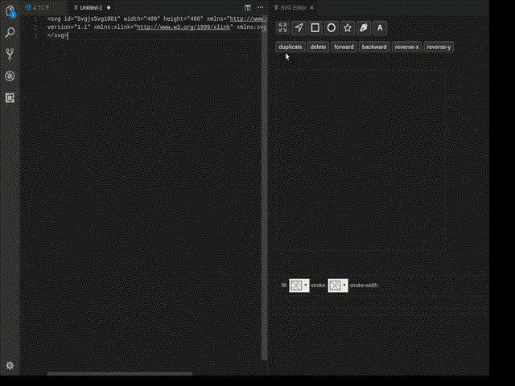

# SVG Editor

Now your VSCode can mutate to an interactive visual & literal SVG editor 😎

You can create shapes using the SVG's coder or directly creating shapes with the shaping tool.

## Commands

- New File with SVG Editor
  - Open untitled file with SVG template.
- Open SVG Editor
  - Target active SVG tab to edit with SVG Editor.

## Kinds of operation

- Hand mode
  - Scale and translate.
- Node mode
  - Edit node of polyline, polygon.
- Rectangle, ellipse, polygon, path mode
  - Make new object.

## Future plans

- [ ] Reimplement rotation
- [x] Reimplement path mode
- [ ] Reimplement text mode
- [ ] Reimplement group and ungroup
- [x] Reflect embedded CSS in SVG
- [ ] Attributes output style options
- [ ] Line cap, marker
- [ ] Scale objects with fixed aspect ratio mode
- [ ] `defs` tag
- [ ] `use` tag
- [ ] unit
- [x] Gradation colors
- [ ] No fixed transform attribute
- [ ] Zoom
- [ ] Handle images

## ChangeLog

- 0.7.0 Support linear and radial gradients
- 0.6.0 Use elm-mdl
- 0.5.3 Fix display size
- 0.5.2 Fix color in hand mode
- 0.5.1 Got better
- 0.5.0 Enable to resolve reference. Elements filled with linearGradient are recognized correct for example.
- 0.4.5 Fix bug of new file command
- 0.4.4 Add path mode again
- 0.4.3 Add opacity adjustment button and fix style bugs
- 0.4.2 Enable to select path element again
- 0.4.1 Support embedded CSS again
- 0.4.0 Reimplement with Elm. Many things have improved, but some functions are temporary unavailable 😥
- 0.3.0 Added group and ungroup button, improved right click menu
- 0.2.0 Affected embedded CSS in SVG
- 0.1.0 Released

## License

MIT
